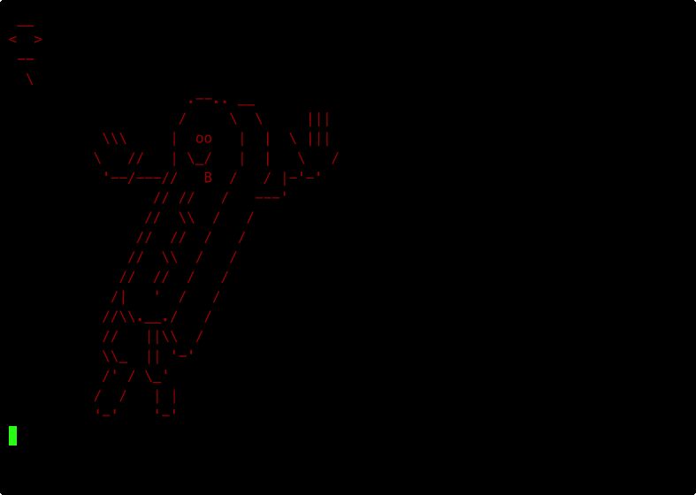

# SaucisseSay — README 

Ce programme C affiche une “saucisse” en ASCII-art, avec :
- des **modes** (borg, dead, greedy, etc.) qui modifient yeux/langue/poignet,
- inspiré de cowsay avec des options supplémentaires.
- une option **couleur** (`-c <couleur>`),
- une option **animation** (`-bouge [distance]`) qui fait “glisser” la saucisse vers la droite.
- une option **message fixe** (`-r "texte"`) façon cowsay.
- une option **reading cow** (`-read <fichier>`) qui fait lire un texte caractère par caractère.

## Demo


---

# 1) Compilation et exécution

## Compiler
## Compilation rapide avec `make` (recommandé)

Le projet inclut un **Makefile** permettant de compiler automatiquement le programme.

### Compiler

```bash
make
```

Cela exécute automatiquement la commande `gcc` avec les bons paramètres et génère l’exécutable :

```bash
./saucisse
```

### Nettoyer les fichiers compilés

```bash
make clean
```

Cela supprime l’exécutable généré.

---

## Compilation manuelle (alternative)

Si vous ne souhaitez pas utiliser `make`, vous pouvez compiler manuellement avec :

```bash
gcc -Wall -Wextra -O2 -o saucisse saucisse.c
```

### Explication des flags

| Option        | Rôle                                |
|---------------|-------------------------------------|
| `-Wall`       | Active les warnings standards       |
| `-Wextra`     | Active des warnings supplémentaires |
| `-O2`         | Optimisation niveau 2               |
| `-o saucisse` | Nom du binaire généré               |

---

# 2) Les bibliothèques utilisées

```c
#include <stdio.h>
#include <string.h>
#include <unistd.h>
#include <stdlib.h>
```

## `<stdio.h>`
Standard Input Output.

Fonctions utilisées :
- `printf()`
- `fopen()`
- `fclose()`
- `fgetc()`
- `fflush()`
- `perror()`
- `stdin`
- `FILE`

---

## `<string.h>`

Manipulation des chaînes :

- `strcmp()` → comparer deux chaînes
- `strlen()` → longueur d’une chaîne

---

## `<unistd.h>`

Fonctions système POSIX :

- `sleep()` → pause en secondes
- `usleep()` → pause en microsecondes

---

## `<stdlib.h>`

- `atoi()` → convertir string → int
- `NULL`
- gestion mémoire standard

---

# 3) Types fondamentaux utilisés

## `int`
Entier signé.

## `char`
Caractère (1 octet).

## `char *`
Pointeur vers une chaîne de caractères.

## `const char *`
Pointeur vers chaîne non modifiable.

## `FILE *`
Pointeur vers structure représentant un flux de fichier.

---

# 4) Les chaînes C

Une chaîne C est :

- un tableau de `char`
- terminé par `\0`

Exemple :

```c
char txt[] = "bonjour";
```

En mémoire :

```
b o n j o u r \0
```

---

# 5) Codes ANSI pour la couleur

Exemple :

```c
#define ROUGE "\033[31m"
#define RESET "\033[0m"
```

## Décomposition

`\033` = caractère ESC (ASCII 27)

`[31m` = instruction terminal → rouge

`[0m` = reset format

Le terminal interprète ces séquences, pas le programme.

---

# 6) La fonction update()

```c
void update(void) { printf("\033[H\033[J"); }
```

## Explication détaillée

| Code     | Effet                  |
|----------|------------------------|
| `\033[H` | Curseur en haut gauche |
| `\033[J` | Efface l’écran         |

Cela permet de redessiner au même endroit → illusion d’animation.

---

# 7) printf et les formats

`printf("texte %s %d\n", var1, var2);`

### Spécificateurs utilisés :

| Code | Signification |
|------|---------------|
| `%s` | chaîne        |
| `%d` | entier        |
| `\n` | nouvelle ligne|

---

# 8) Les structures de contrôle utilisées

## `if`
Test conditionnel.

## `else if`
Branchement alternatif.

## `while`
Boucle conditionnelle.

## `for`
Boucle compteur.

---

# 9) Parsing des arguments (`argc`, `argv`)

Signature :

```c
int main(int argc, char *argv[])
```

## `argc`
Nombre d’arguments.

## `argv`
Tableau de chaînes.

Exemple :

```bash
./saucisse -c rouge -bouge 40
```

| Index | Valeur     |
|-------|------------|
| 0     | ./saucisse |
| 1     | -c         |
| 2     | rouge.     |
| 3     | -bouge     |
| 4     | 40         |

---

## Pourquoi `i + 1 < argc` ?

Évite lecture hors limites mémoire.

Sinon → segmentation fault.

---

## Pourquoi `argv[i+1][0] != '-'` ?

Permet distinguer :

```
-bouge 40
```

et

```
-bouge -t
```

---

# 10) `strcmp()`

```c
strcmp(a,b) == 0
```

Retourne 0 si les chaînes sont identiques.

Sinon :

- <0 si a < b
- >0 si a > b

---

# 11) `atoi()`

Convertit une chaîne en entier.

* Ne gère pas les erreurs.

Ex :

```
atoi("40") → 40
atoi("abc") → 0
```

---

# 12) `strlen()`

Retourne longueur d’une chaîne sans compter `\0`.

---

# 13) La bulle dynamique

```c
int w = strlen(text);
```

On adapte la largeur :

- ligne du haut : `_`
- ligne du bas : `-`

---

# 14) Macro INDENT

```c
#define INDENT do { ... } while (0)
```

## Pourquoi `do { } while (0)` ?

Permet d’utiliser la macro comme une instruction normale :

```
INDENT;
```

Sans problème de portée.

---

# 15) Reading Cow — Fonctionnement interne

## `fgetc(FILE *f)`

Lit 1 caractère.

Retourne :
- caractère lu
- `EOF` si fin fichier

---

## Buffer interne

```c
char eaten[2048];
```

Stockage des caractères avalés.

Pourquoi 2048 ?

- Taille raisonnable
- Évite allocation dynamique

---

## Ajout caractère

```c
eaten[len++] = ch;
eaten[len] = '\0';
```

Important : toujours maintenir `\0` final.

---

# 16) Animation synchronisée

Boucle principale :

1. Lire caractère
2. Afficher caractère dans gueule
3. Attendre
4. Ajouter à bulle
5. Déplacer si nécessaire

---

# 17) `sleep(1)`

Pause de 1 seconde.

Utilise l’horloge système.

---

# 18) `fflush(stdout)`

Forcer affichage immédiat.

Sans ça :

- stdout peut bufferiser
- animation non fluide

---

# 19) Gestion des fichiers

```c
fopen(path,"r");
```

- "r" = lecture seule

Retourne `NULL` si erreur.

---

## stdin

Flux standard d’entrée.

Permet :

```
echo bonjour | ./saucisse -read
```

---

# 20) Conditions d’arrêt reading

Arrêt si :

```
EOF atteint
ET
offset >= max_offset
```

---

# 21) Gestion mémoire

Aucune allocation dynamique.

Tout est stack-based.

---

# 22) Complexité

Lecture : O(n)

Animation : O(n + distance)

---

# 23) Sécurité

Vérifications :

- `i + 1 < argc`
- `f != NULL`

---

# 24) Résumé des options

| Option   | Arguments    | Effet        |
|----------|--------------|--------------|
| `-c`     | couleur      | Couleur ANSI |
| `-e`     | string       | Yeux         |
| `-r`     | texte        | Bulle fixe   |
| `-read`  | fichier      | Reading Cow  |
| `-bouge` | distance     | Animation    |
| `-b`     | —            | Borg         |
| `-d`     | —            | Dead         |
| `-g`     | —            | Greedy       |
| `-p`     | —            | Paranoia     |
| `-s`     | —            | Stoned       |
| `-t`     | —            | Tired        |
| `-w`     | —            | Wired        |
| `-y`     | —            | Youth        |

---

# 25) Limitations

- Pas de gestion automatique des retours à la ligne
- Buffer limité à 2048 caractères
- Couleurs dépendantes du terminal
- `atoi` non sécurisé

---

# 26) Améliorations possibles

- malloc dynamique
- wrapping automatique
- animation gauche/droite
- couleurs partielles

---

# 27) Exemples d’exécution avancés (démonstrations complètes)

Cette section propose des exemples permettant de tester **plusieurs fonctionnalités en même temps**.

---

## 1) Démo couleur + animation + mode

```bash
./saucisse -c rouge -bouge 30 -t
```

Effets combinés :

- Couleur rouge
- Animation vers la droite (30 espaces)
- Mode tired (yeux modifiés)

---

## 2) Démo message fixe façon cowsay

```bash
./saucisse -c cyan -r "HELLO WORLD"
```

Effets :

- Bulle statique
- Couleur cyan
- Saucisse sans animation

---

## 3) Démo Reading Cow simple

Créer un fichier :

```bash
echo "bonjour tout le monde" > demo.txt
```

Puis :

```bash
./saucisse -read demo.txt
```

Effet :

- Lecture caractère par caractère
- 1 seconde entre chaque lettre
- La lettre apparaît d’abord dans la gueule
- Puis passe dans la bulle

---

## 4) Reading Cow + Animation synchronisée

```bash
./saucisse -bouge 20 -read demo.txt
```

Effet :

- 1 caractère lu = 1 déplacement
- Si le texte est plus long → lecture continue sur place
- Si distance plus grande → mouvement continue après lecture

---

## 5) Démo maximale (tout en même temps)

```bash
./saucisse -c violet -bouge 40 -read demo.txt -g
```

Combine :

- Couleur violette
- Mode greedy
- Animation
- Reading Cow

---

## 6) Lecture via stdin (pipe)

```bash
echo "Bonjour depuis stdin!" | ./saucisse -bouge 22 -read
```

Permet :

- Lecture depuis pipe
- Pas besoin de fichier
- Fonctionne avec redirection ou autre programme
